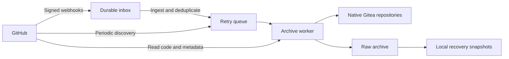

# GitHub to Gitea Archive 🗄️

[](https://github.com/xixu-me/github-to-gitea-archive/actions/workflows/ci.yml)
[](#requirements)
[](LICENSE)

**English** | [汉语（简体）](README.zh.md)

**GitHub to Gitea Archive** continuously archives a GitHub user or organization's repositories on your own server, with Gitea for browsing code, issues, pull requests and releases. It automatically discovers new repositories, tracks source changes and retains local copies when source data disappears.

GitHub remains the source of truth. The archive reads from GitHub and writes to your local Gitea instance; it never pushes changes back to GitHub.

## Features

- **Automatic Discovery**: Signed webhooks and periodic scans discover new repositories, including public, private, forked and archived repositories accessible to your credentials.
- **Code and Metadata**: Archive Git history, branches, tags, PR head refs, accessible wikis, issues, reviews, releases and their associated metadata.
- **Gitea Integration**: Browse native repositories, issues, comments and releases. PRs are projected when Gitea can represent them; raw records preserve the remaining details.
- **Deletion Awareness**: Track additions, edits and removals while retaining captured data. Distinguish confirmed deletion, transfer and loss of access.
- **Private Repository Protection**: Guard public-to-private transitions, restrict raw archives to the configured management user and keep credentials out of Git process arguments.
- **Single-Host Operation**: Python standard library only, durable webhook intake, retry queues, resource limits and local recovery snapshots.

## Quick Start

### Requirements

- Linux with systemd and Nginx, Python **3.11+**, Git and OpenSSL.
- An existing **local Gitea 28 instance using SQLite in WAL mode**. Other Gitea versions and database engines have not been validated.
- A dedicated Gitea archive user or organization, plus a user API token with repository read/write and user-profile read permissions. The runtime does not require a Gitea administrator token.
- A read-only GitHub App or PAT to access private repositories. Public accounts also support polling without credentials, subject to GitHub's unauthenticated rate limits.
- HTTPS and a public callback/webhook URL for GitHub App setup and event-driven updates.

Each installation archives **one GitHub account**. Use separate state directories, Gitea namespaces, ports and systemd unit names for multiple accounts.

### Installation

```sh
git clone https://github.com/xixu-me/github-to-gitea-archive.git
cd github-to-gitea-archive

# Install the runtime, service units and Nginx configuration example.
sudo python3 scripts/install.py

# Configure your GitHub account, Gitea namespace and credentials.
sudoedit /etc/gitea/github-archive.env
```

After preparing the Gitea namespace, token and WAL mode, validate your configuration:

```sh
sudo -u git /usr/local/lib/github-archive/archive.py --env-file /etc/gitea/github-archive.env check
```

Follow the [deployment guide](docs/deployment.md) to configure Nginx, create and install a read-only GitHub App or configure a PAT, and enable the discovery, ingest, worker and snapshot timers.

The installer preserves existing environment files. It does not install Gitea, change its configuration or start services. Use `--root /path/to/staging` to inspect the generated installation files before deployment.

For a runtime-only Python installation, `python3 -m pip install .` provides the `github-archive` command. Use the checked-out installer for systemd deployments so the audit tools and deployment examples are installed together.

## Archive Coverage

| Source | Local archive | Gitea representation |
| --- | --- | --- |
| Code and wikis | Branches, tag objects, PR head refs, previously observed tips and accessible wiki Git repositories | Native Git repositories; branch records refreshed through Gitea's own hook |
| Issues | Latest captured JSON, comments, events, timeline, reactions, labels and milestones | Issues, comments, labels and milestones with source attribution |
| Pull requests | List and full detail records, reviews, review comments and reactions, commits, file manifests and available patches | Representable PRs; explicit gaps for incompatible PR states |
| Releases | Release records and fully enumerated asset metadata, including links, sizes and available digests | Releases and source asset links |
| Attachments and LFS | Attachment links and default-branch LFS pointer inventory; historical pointers retained in Git | Links and manifests; binary payloads are not downloaded |

Source authors and timestamps remain available as archived data and attribution. The archive does not impersonate their native Gitea activity. Merged PRs, missing fork refs and other incompatible states remain available through raw records and documented projection gaps.

## Synchronization and Deletion

New repositories are discovered automatically. Renames retain the same numeric GitHub repository identity, and subsequent code and metadata changes update the local archive.

| Source change | Archive behavior |
| --- | --- |
| Branch or tag deleted | Remove the current ref; retain previously observed tips under `refs/archive/history/` |
| Issue, comment, PR or release disappears | Retain the last captured record and mark its source presence absent; representable native records carry an absence notice |
| Parent record disappears | Cascade absence to captured descendants, including comments, reactions, reviews, PR files and release assets |
| Repository deletion confirmed | Mark `deleted`, stop synchronization and label the Gitea copy as a retained archive |
| Transfer to another account confirmed | Mark `transferred` and retain the original archive |
| Repository missing or access removed | Mark `unavailable`; missing inventory entries and HTTP 404 responses do not prove deletion |
| Same repository ID reappears | Mark `active`, resume synchronization, remove the warning and refresh metadata and wiki state |

Confirmed deletion or transfer is not overwritten by a later installation-access removal event. See the [source lifecycle documentation](docs/lifecycle.md) for event ordering, evidence and recovery behavior.

The archive preserves the **latest captured JSON**, not every edit revision. Synchronization is eventual: rate limits and queue depth affect latency, and data created and removed between observations may never be captured.

## Configuration

Configuration uses environment variables or an `--env-file`. Start with [`deploy/archive.env.example`](deploy/archive.env.example).

| Variable | Purpose |
| --- | --- |
| `GITHUB_OWNER` | Required GitHub user or organization login |
| `GITHUB_ACCOUNT_TYPE` | `auto`, `user` or `organization` |
| `GITEA_OWNER` | Dedicated local archive namespace; defaults to the source login |
| `ARCHIVE_ADMIN_USER` | Gitea user authorized to access the raw dashboard and act as the hook pusher |
| `GITEA_URL` / `GITEA_TOKEN` | Internal Gitea endpoint and namespace-management token |
| `ARCHIVE_PUBLIC_URL` | Public HTTPS origin for GitHub App setup and webhooks |
| `GITHUB_TOKEN` | Optional read-only PAT; App credentials take precedence |
| `ARCHIVE_ROOT` | Private state, credentials, snapshots and audit reports |

The state directory is bound to its GitHub/Gitea account pair. Changing either account requires a fresh state directory and target namespace or a planned migration. See [configuration](docs/configuration.md) for paths, ports, disk budgets and all available settings.

## Architecture



Webhook deliveries are committed before acknowledgment. Separate SQLite databases keep intake independent of long worker writes, and delivery IDs are deduplicated for seven days. Failed jobs remain queued with backoff; disk thresholds and systemd resource limits bound work. The default low-space cutoff is **500 MiB**.

Include the supplied Nginx privacy guard and keep the Python backend private to the host. The raw dashboard and exports require the configured management user and use `noindex`; public native Gitea repositories remain browsable. Authenticated API requests are restricted to their configured origin and do not follow redirects.

Daily current/previous database and configuration snapshots support local recovery. They do not protect against loss of the host or disk. See [architecture](docs/architecture.md) and [operations](docs/operations.md) for implementation details and restoration procedures.

## Scope and Limits

The archive captures observed source state across multiple GitHub endpoints; it does not provide a point-in-time transaction or recover data it never observed. Credentials only grant access to repositories within their permissions.

Actions runs and artifacts, packages, Discussions, Projects, release binaries, issue attachment bytes and LFS object bytes are outside the archive's scope. Attachments and LFS are represented by links, manifests and pointers. Native PR representation and API patch limits remain visible in the archive.

## Development

```sh
python3 -m pip install --no-deps -e .
python3 -m unittest discover -s tests -p 'test_*.py'
python3 -m compileall -q src tests scripts
python3 scripts/check_public.py
```

Local tests use temporary repositories and fixtures without writing to GitHub. Independent [acceptance tools](docs/operations.md#acceptance) compare live Git refs, parent/child metadata, native Gitea projections and restored snapshots. Acceptance reports stay in the private state directory.

## Repository Structure

```text
src/github_archive/   Python package and runtime CLI
  audits/             Independent acceptance tools and audit CLI
scripts/              Installation and publication checks
deploy/               systemd, Nginx and Gitea configuration templates
docs/                 Deployment, architecture and operation guides
tests/                Offline regression and installation tests
```

After installing the Python package, use `github-archive` or `python3 -m github_archive` for runtime commands, and `github-archive-audit` or `python3 -m github_archive.audits` for acceptance tools. The system installer supplies launchers under `/usr/local/lib/github-archive/`, including the existing `archive.py`, `audit_*.py` and `gitea-git.py` paths.

## Project Resources

- [Deployment](docs/deployment.md) — Gitea, Nginx, GitHub App/PAT and service setup
- [Configuration](docs/configuration.md) — account, credential, path and resource settings
- [Architecture](docs/architecture.md) — intake, synchronization, storage and privacy protection
- [Source Lifecycle](docs/lifecycle.md) — additions, edits, removals and retained archives
- [Operations and Recovery](docs/operations.md) — monitoring, acceptance and restoration
- [Contributing](CONTRIBUTING.md) — development and contribution guidelines
- [Security Policy](SECURITY.md) — reporting vulnerabilities and protecting credentials

## License

Copyright © [Xi Xu](https://xi-xu.me). Licensed under the [MIT License](LICENSE).
