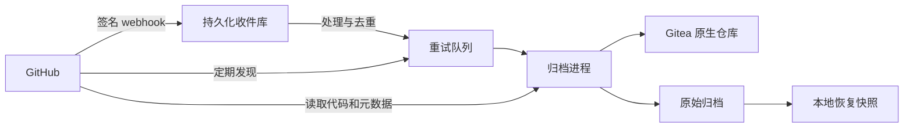

# GitHub to Gitea Archive 🗄️

[](https://github.com/xixu-me/github-to-gitea-archive/actions/workflows/ci.yml)
[](#环境要求)
[](LICENSE)

[English](README.md) | **汉语（简体）**

**GitHub to Gitea Archive** 将任意 GitHub 用户或组织的仓库持续归档到自己的服务器，并通过 Gitea 浏览代码、Issue、Pull Request 和 Release。自动发现新增仓库、跟踪来源变化，在来源数据消失后保留本地副本。

GitHub 始终是数据来源。归档服务从 GitHub 读取内容并写入本地 Gitea，不会向 GitHub 写回修改。

## 功能特性

- **自动发现**：通过签名 webhook 和定期扫描发现新增仓库，涵盖凭据可读取的公开、私有、Fork 和已归档仓库。
- **代码与元数据**：归档 Git 历史、分支、标签、PR head 引用、可访问的 Wiki，以及 Issue、Review、Release 和关联元数据。
- **Gitea 集成**：使用原生仓库、Issue、评论和 Release 浏览归档；能够表示的 PR 投影为原生 PR，其余详情保留在原始记录中。
- **删除感知**：跟踪增、删、改并保留已捕获的数据，区分明确删除、转移和失去访问权限。
- **私有仓库保护**：保护公开转私有过程，限制原始归档访问权限，避免将凭据放入 Git 进程参数。
- **单机运行**：Python 运行时仅使用标准库，提供持久化 webhook 收件、重试队列、资源限制和本地恢复快照。

## 快速开始

### 环境要求

- Linux、systemd、Nginx、Python **3.11+**、Git 和 OpenSSL。
- 已部署在同一台服务器上的 **Gitea 28，使用 SQLite WAL 模式**。其他 Gitea 版本和数据库引擎尚未验证。
- 专用的 Gitea 归档用户或组织，以及具有仓库读写和用户资料读取权限的用户 API token。运行时无需 Gitea 管理员 token。
- 读取私有仓库所需的只读 GitHub App 或 PAT。公开账号也支持无凭据轮询，但受 GitHub 匿名 API 限额约束。
- 用于 GitHub App 配置和事件同步的 HTTPS 域名及公开 callback/webhook 地址。

每套实例归档**一个 GitHub 账号**。归档多个账号时，分别使用独立的数据目录、Gitea 命名空间、端口和 systemd 单元名称。

### 安装

```sh
git clone https://github.com/xixu-me/github-to-gitea-archive.git
cd github-to-gitea-archive

# 安装运行时、服务单元和 Nginx 配置示例。
sudo python3 scripts/install.py

# 配置 GitHub 账号、Gitea 命名空间和凭据。
sudoedit /etc/gitea/github-archive.env
```

准备好 Gitea 命名空间、token 和 WAL 模式后，检查配置：

```sh
sudo -u git /usr/local/lib/github-archive/archive.py --env-file /etc/gitea/github-archive.env check
```

按照[部署指南](docs/deployment.md)配置 Nginx，创建并安装只读 GitHub App 或配置 PAT，然后启用发现、收件处理、归档和快照定时器。

安装器保留已有环境文件，不安装 Gitea、不修改其配置，也不启动服务。使用 `--root /path/to/staging` 可在部署前查看生成的安装文件。

仅安装 Python 运行时时，执行 `python3 -m pip install .` 即可获得 `github-archive` 命令。systemd 部署使用仓库中的安装器，以便一并安装验收工具和部署示例。

## 归档范围

| 来源 | 本地归档 | Gitea 中的表示 |
| --- | --- | --- |
| 代码与 Wiki | 分支、标签对象、PR head 引用、已观察到的历史提交及可访问的 Wiki Git 仓库 | 原生 Git 仓库，通过 Gitea 自身的 hook 刷新分支记录 |
| Issue | 最新捕获的 JSON、评论、事件、时间线、Reaction、标签和里程碑 | 带来源说明的 Issue、评论、标签和里程碑 |
| Pull Request | 列表及完整详情、Review、Review 评论与 Reaction、提交、文件清单和可获取的补丁 | 能够表示的原生 PR，以及无法兼容的 PR 状态说明 |
| Release | 发布记录及完整分页枚举的资源元数据，包括链接、大小和可获取的摘要 | Release 和来源资源链接 |
| 附件与 LFS | 附件链接、默认分支 LFS 指针清单；历史指针保留在 Git 中 | 链接和清单，不下载二进制文件内容 |

来源作者和时间戳以归档数据及来源说明保留，不冒充他们在 Gitea 中的原生活动。已合并 PR、缺失的 Fork 引用和其他无法兼容的状态，可通过原始记录及明确的投影差异查看。

## 同步与删除策略

新增仓库自动发现。仓库改名仍沿用同一个 GitHub 数字 ID，后续代码和元数据修改持续更新本地归档。

| 来源变化 | 归档行为 |
| --- | --- |
| 删除分支或标签 | 移除当前引用，将已观察到的历史提交保留在 `refs/archive/history/` |
| Issue、评论、PR 或 Release 消失 | 保留最后捕获的记录并标记来源不存在；能够表示的原生记录附有来源缺失提示 |
| 父记录消失 | 级联标记已捕获的子记录，包括评论、Reaction、Review、PR 文件和 Release 资源 |
| 确认仓库删除 | 标记为 `deleted`，停止同步，并在 Gitea 中注明归档保留 |
| 确认转移到其他账号 | 标记为 `transferred`，保留原有归档 |
| 仓库不可见或访问权限被移除 | 标记为 `unavailable`；清单缺失或 HTTP 404 不能证明仓库已删除 |
| 同一仓库 ID 重新出现 | 标记为 `active`，恢复同步、移除提示，并刷新元数据和 Wiki 状态 |

已确认的删除或转移，不会被后续的安装访问权限移除事件覆盖。事件顺序、证据和恢复行为详见[来源生命周期文档](docs/lifecycle.md)。

归档保留每个对象**最新捕获的 JSON**，不保存每次编辑版本。同步具有延迟，受 API 限额和队列长度影响；两次观察之间创建又删除的数据可能无法捕获。

## 配置

通过环境变量或 `--env-file` 配置，示例见 [`deploy/archive.env.example`](deploy/archive.env.example)。

| 变量 | 用途 |
| --- | --- |
| `GITHUB_OWNER` | 必填，GitHub 用户或组织登录名 |
| `GITHUB_ACCOUNT_TYPE` | `auto`、`user` 或 `organization` |
| `GITEA_OWNER` | 专用的本地归档命名空间，默认与来源登录名相同 |
| `ARCHIVE_ADMIN_USER` | 有权访问原始归档面板并作为 hook 推送者的 Gitea 用户 |
| `GITEA_URL` / `GITEA_TOKEN` | Gitea 内部地址及命名空间管理 token |
| `ARCHIVE_PUBLIC_URL` | 用于 GitHub App 配置和 webhook 的公开 HTTPS 源站地址 |
| `GITHUB_TOKEN` | 可选的只读 PAT；已有 App 凭据时优先使用 App |
| `ARCHIVE_ROOT` | 私有状态、凭据、快照和验收报告目录 |

数据目录绑定 GitHub/Gitea 账号组合。更换任一账号时，应使用新的数据目录和目标命名空间，或实施明确的迁移。路径、端口、磁盘预算和全部设置见[配置文档](docs/configuration.md)。

## 架构



webhook 在持久化提交后才确认接收。独立的 SQLite 数据库让收件过程不受归档进程长时间写入影响，投递 ID 保留七天用于去重。失败任务留在队列中退避重试，通过磁盘阈值和 systemd 资源限制控制工作量；默认低空间停止阈值为 **500 MiB**。

部署时包含提供的 Nginx 隐私保护配置，Python 后端仅在本机开放。原始归档面板和导出要求配置的管理用户登录，并设置 `noindex`；公开的 Gitea 原生仓库仍可浏览。带认证的 API 请求仅发送到配置的源站，不跟随重定向。

每日保留当前及上一份数据库和配置快照，用于本机恢复。快照不能应对整台服务器或磁盘丢失。实现细节及恢复步骤见[架构](docs/architecture.md)和[运维](docs/operations.md)文档。

## 能力边界

归档记录跨多个 GitHub 接口观察到的来源状态，不提供所有接口同一时间点的事务快照，也无法恢复从未观察到的数据。凭据只能读取其权限范围内的仓库。

不归档 Actions 运行及产物、Packages、Discussions、Projects、Release 二进制、Issue 附件内容和 LFS 对象内容。附件与 LFS 以链接、清单和指针表示。原生 PR 的表示差异与 API 补丁限制会在归档中说明。

## 开发

```sh
python3 -m pip install --no-deps -e .
python3 -m unittest discover -s tests -p 'test_*.py'
python3 -m compileall -q src tests scripts
python3 scripts/check_public.py
```

本地测试使用临时仓库和测试数据，不向 GitHub 写入。独立的[验收工具](docs/operations.md#acceptance)对比实时 Git 引用、父子元数据、Gitea 原生投影和恢复快照；验收报告保存在私有数据目录中。

## 文件结构

```text
src/github_archive/   Python 包和归档命令入口
  audits/             独立验收工具和验收命令入口
scripts/              安装及公开发布检查
deploy/              systemd、Nginx 和 Gitea 配置模板
docs/                 部署、架构和运维文档
tests/                离线回归及安装测试
```

安装 Python 包后，使用 `github-archive` 或 `python3 -m github_archive` 运行归档命令，使用 `github-archive-audit` 或 `python3 -m github_archive.audits` 运行验收工具。系统安装器在 `/usr/local/lib/github-archive/` 生成启动脚本，保留原有 `archive.py`、`audit_*.py` 和 `gitea-git.py` 路径。

## 项目资源

- [部署指南](docs/deployment.md)：Gitea、Nginx、GitHub App/PAT 和服务配置
- [配置说明](docs/configuration.md)：账号、凭据、路径和资源设置
- [架构设计](docs/architecture.md)：收件、同步、存储和隐私保护
- [来源生命周期](docs/lifecycle.md)：增、删、改与归档保留
- [运维与恢复](docs/operations.md)：监控、验收和恢复流程
- [贡献指南](CONTRIBUTING.md)：开发和贡献约定
- [安全政策](SECURITY.md)：漏洞报告及凭据保护

## 许可证

版权所有 © [Xi Xu](https://xi-xu.me)，基于 [MIT 许可证](LICENSE) 开源。
