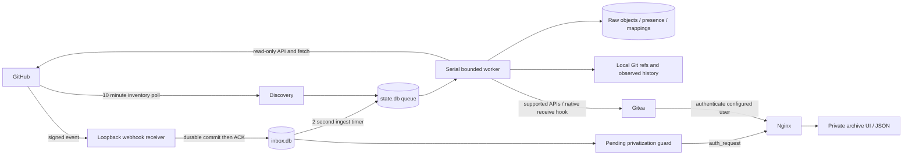

# Architecture

## Discovery and work

Repository identity is the GitHub numeric ID. App installations enumerate authorized installation repositories, then filter by account. PATs enumerate private owned repositories for their authenticated user, authorized organization repositories, or another user's public inventory. Successful disappearance marks a source unavailable and retains all local data; enumeration errors do not pretend to be an empty inventory.

Jobs coalesce by repository, with event priority and exponential retry backoff. Workers hold an exclusive advisory lock. An interrupted job remains in SQLite and can be replayed. Git object tips are retained under `refs/archive/history/` before fetch/prune; PR refs are namespaced under `refs/archive/pull/`. Branch/tag/default HEAD checks distinguish observed consistency from concurrent upstream changes.

`git fetch` does not execute receive hooks. After each fetch, the worker compares native branch records, invokes the existing Gitea hook for actual create/update/delete/revive changes, and verifies the resulting ledger. It does not synthesize commits or alter source Git objects. A real local user is used as the hook pusher even when the archive namespace is an organization.

## Raw records and native projections

Compressed JSON is stored separately from native Gitea mappings. Presence records distinguish an active source object from a locally retained deleted record. Stable source-ID markers recover uncertain native POST outcomes; full source author/time data is retained without impersonation. Native merged flags are not manufactured, and unrepresentable PRs never become fake issues. Projection gaps are exposed in status.

Issue/PR parent scans are incremental, but review/comment events invalidate deep child checkpoints because edits may not change their parent's timestamp. Dedicated release asset endpoints prevent silently accepting a truncated embedded inventory. API page limits and response budgets produce explicit failures. The service does not claim a globally atomic snapshot of GitHub.

## Webhook ACK and privacy

The response path verifies HMAC, inserts into an independent durable WAL inbox, then returns 202. It does not wait to write `state.db` or perform source synchronization. Ingest later commits a delivery to the main queue before clearing its inbox payload; replay after a crash is idempotent.

A signed private-source announcement raises an inbox privacy gate before response. Native Gitea access is blocked at Nginx while that transition is outstanding. Per-repository visibility locks serialize protection with final worker settings. Before native writes or branch notifications, the worker considers both main state and pending inbox privacy signals. Failed protection retains the payload/gate. Guard failure blocks access rather than making private data public.

An already-private source does not require a site-wide transition gate. The gate nevertheless protects the entire native site during a transition, preferring bounded loss of availability over a privacy leak. Do not publish local backend ports or bypass the supplied guard in alternate Nginx locations.

## Boundaries

The main and inbox SQLite databases, raw exports and snapshots are private service data. App/PAT credentials grant source reads only. Gitea's token grants writes solely to the dedicated local archive namespace. The environment/state namespace binding catches accidental account reuse, not hostile administrators with access to the host. Existing GitHub and Gitea access controls remain part of the trust boundary.

## Package layout and installed compatibility

The `src/github_archive` package contains the runtime (`archive.py`), configuration parsing (`config.py`) and optional Git budget wrapper (`gitea_git.py`). Independent acceptance tools live in `audits`, with a shared configuration loader and a CLI dispatcher. Importing an audit module does not start an audit or open production databases; execution starts through its `main` function.

The Python wheel exposes `github-archive` and `github-archive-audit`, and both CLIs support `python -m` execution. Repository scripts are limited to installation and publication checks. `deploy` holds service and proxy templates, `docs` holds operator guides, and `tests` holds offline fixtures and regression coverage.

The system installer copies the package under `/usr/local/lib/github-archive/github_archive` and generates launchers at the established `archive.py`, `audit_*.py` and `gitea-git.py` paths, plus the unified `audit.py` entry point. Existing systemd units and Gitea Git-wrapper configuration therefore keep their paths. Runtime and audit source files, including nested package files, are included in configuration snapshots. No state database schema or credential format changes are required by this layout migration.
